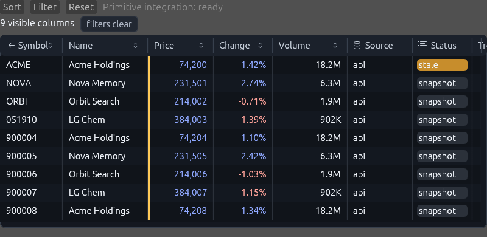

# Finui

Finui is a Rust workspace for dense, testable financial user interfaces built on
`egui`.

The first release candidates are:

- `finui-primitives`: Radix-style primitive controls for immediate-mode egui apps.
- `finui-grid`: an agent-testable financial data grid with typed cells, row sources,
  provenance metadata, sorting, filtering, virtual sources, export helpers, and demo
  fixtures.

## Status

This repository is pre-release. APIs are being narrowed before crates.io publication.
Use git dependencies while the surface is stabilizing.

## Workspace

```text
crates/
  finui-primitives/
  finui-grid/
examples/
  grid_lab/
  primitives_lab/
docs/
```

## Quick Check

Use the quick path during ordinary development. It keeps format, compile, feature
boundary, and crate-level lib tests fast.

```powershell
powershell -ExecutionPolicy Bypass -File scripts/check-quick.ps1
```

Use the full path before publishing or opening a broad pull request. It includes
the quick gates plus workspace clippy and workspace tests.

```powershell
powershell -ExecutionPolicy Bypass -File scripts/check-full.ps1
```

## Examples

```powershell
cargo run -p grid_lab
cargo run -p primitives_lab
```

## Sample Screenshot



## Feature Boundaries

`finui-grid` keeps generic row-source contracts in core:

- `GridRowSource`
- `InMemoryGridSource`
- `StreamingGridSource`
- `VirtualGridSource`

Endpoint and DuckDB-style table payload fixtures are behind the `fixtures` feature.
The default feature keeps the demo convenient, while `--no-default-features` proves
the core grid is not coupled to those fixtures.

API stability levels, preview/internal boundaries, and breaking-change rules are
defined in `docs/api-stability-policy.md`.

## License

Apache-2.0. Radix icon assets under `crates/finui-primitives/assets/radix-icons`
retain their upstream MIT license notice.
