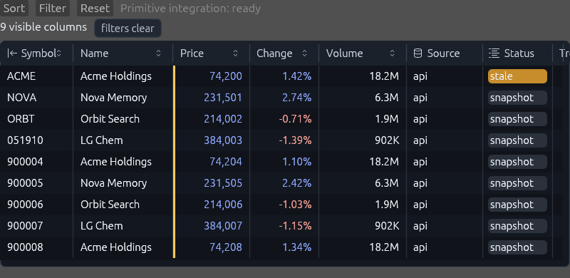

# Finui

Finui is a Rust workspace for dense, testable financial user interfaces built on
`egui`.

The first release candidates are:

- `finui-primitives`: Radix-style primitive controls for immediate-mode egui apps.
- `finui-grid`: an agent-testable financial data grid with typed cells, row sources,
  provenance metadata, sorting, filtering, virtual sources, export helpers, and demo
  fixtures.
- `finui-timeline`: a Preview integer-tick timeline with indexed viewport culling,
  clip geometry, transactional drag actions, and UX receipts.
- `finui-media-surface`: a Preview external-texture surface with aspect-fit geometry,
  transform overlays, typed actions, and UX receipts.
- `finui-workbench`: a Preview split-pane and tab shell with caller-owned layout,
  persistence, constraints, focus routing, and typed actions.

## Status

This repository is pre-release. APIs are being narrowed before crates.io publication.
Use git dependencies while the surface is stabilizing.

## Workspace

```text
crates/
  finui-primitives/
  finui-grid/
  finui-timeline/
  finui-media-surface/
  finui-workbench/
examples/
  editor_lab/
  grid_lab/
  primitives_lab/
docs/
```

## Quick Check

Use the quick path during ordinary development. It keeps format, compile, feature
boundary, and crate-level lib tests fast.

```powershell
powershell -ExecutionPolicy Bypass -File scripts/check-quick.ps1
```

Use the full path before publishing or opening a broad pull request. It includes
the quick gates plus workspace clippy and workspace tests.

```powershell
powershell -ExecutionPolicy Bypass -File scripts/check-full.ps1
```

## Examples

```powershell
cargo run -p grid_lab
cargo run -p primitives_lab
cargo run -p editor_lab
```

The existing grid and primitive labs select the `glow` application backend.
`editor_lab` selects `wgpu`. Reusable `finui-*` crates depend only on `egui` and
do not pull in either renderer. The editor lab renders an animated GPU-native
texture and presents it through egui without CPU pixel readback; its ownership,
resize, device-loss, and verification boundaries are documented in
[`docs/editor-texture-bridge.md`](docs/editor-texture-bridge.md).

The same lab composes Media, Preview, Inspector, Timeline, and Agent panels with
the [`finui-workbench` Preview API](docs/workbench-preview-api.md).
Its Timeline and Preview panels exercise the
[`finui-timeline` and `finui-media-surface` Preview APIs](docs/timeline-media-surface-preview-api.md)
against a 10,000-clip fixture and the GPU-native texture bridge.

## Screenshot

The checked-in screenshot shows the current target surface for dense financial
workflows. It lives in `docs/images/` so README previews stay close to the code.



`grid_lab` exercises the financial grid surface: typed cells, dense row layout,
sorting/filtering affordances, row-source metadata, and demo fixtures that mimic
table-like endpoint payloads.

## Feature Boundaries

`finui-grid` keeps generic row-source contracts in core:

- `GridRowSource`
- `InMemoryGridSource`
- `StreamingGridSource`
- `VirtualGridSource`

Endpoint and DuckDB-style table payload fixtures are behind the `fixtures` feature.
The default feature keeps the demo convenient, while `--no-default-features` proves
the core grid is not coupled to those fixtures.

API stability levels, preview/internal boundaries, and breaking-change rules are
defined in `docs/api-stability-policy.md`.

## License

Apache-2.0. Radix icon assets under `crates/finui-primitives/assets/radix-icons`
retain their upstream MIT license notice.
